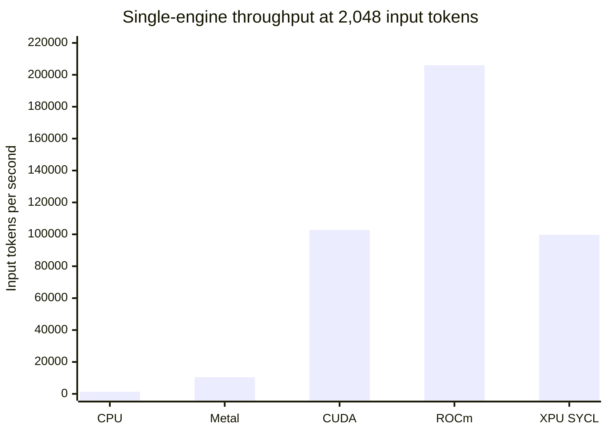

# embeddinggemma.c

Standalone C11 inference and HTTP serving for
`embeddinggemma-300M-qat-Q4_0.gguf`.

- GGUF v3 reader and SentencePiece tokenizer.
- Q4_0/Q8_0 inference on scalar CPU, ARM64 NEON, and x86 SIMD paths.
- Complete Apple Metal backend with kernels embedded in one executable.
- CUDA backend with packed-Q4 warp kernels and FP16 tensor-core projections.
- ROCm backend with packed-Q4 MFMA kernels and batched hipBLAS projections.
- Model-specialized full/SWA attention, mean pooling, and L2 normalization.
- Matryoshka outputs at 768, 512, 256, or 128 dimensions.
- Token-budget dynamic batching with bounded lookahead, duplicate singleflight,
  and an exact-result LRU.
- Bounded HTTP, tokenizer, and inference queues for concurrent serving.
- `GET /api/tags` and `POST /api/embed` HTTP routes.

The CPU, Metal, CUDA, ROCm, and XPU SYCL paths are implemented and
parity-tested.

## Install

Install the latest binary as `~/.local/bin/quixiembed`:

```sh
curl -fsSL https://raw.githubusercontent.com/QuixiAI/embeddinggemma.c/main/install.sh | sh
```

The installer selects Metal on Apple Silicon. On Linux x86_64 it selects CUDA
for NVIDIA, ROCm when an AMD KFD device is present, XPU for a Level Zero GPU,
or CPU otherwise. Missing accelerator runtime libraries trigger an automatic
CPU fallback. It verifies the binary against the release's `SHA256SUMS` before
replacing an existing installation.

Override automatic selection or pin a release when needed:

```sh
./install.sh --variant cpu
./install.sh --version v0.2.5
./install.sh --install-dir "$HOME/bin"
```

The equivalent environment variables are `QUIXIEMBED_VARIANT`,
`QUIXIEMBED_VERSION`, and `QUIXIEMBED_INSTALL_DIR`. Published binaries currently
cover Darwin ARM64 (`cpu`, `metal`) and Linux x86_64 (`cpu`, `cuda`, `rocm`,
`xpu`).

## Build

Build the CPU server:

```sh
make
```

The output is `build/embeddinggemma`.

Build the self-contained Metal server:

```sh
make metal
```

The runtime output is `build/embeddinggemma-metal`; no sidecar file is needed.
The Makefile passes every `.metal` translation unit to one direct `xcrun metal`
invocation, then embeds the resulting metallib in the executable's Mach-O
`__DATA,__metallib` section. `build/embeddinggemma.metallib` remains only as an
intermediate artifact for kernel inspection and the `metal-kernels` target.
Darwin builds default to `MACOSX_DEPLOYMENT_TARGET=14.0`; override it only when
intentionally raising the minimum supported macOS version.

Build the portable CUDA server:

```sh
make cuda NVCC=/usr/local/cuda/bin/nvcc
```

The output is `build/embeddinggemma-cuda`. CUDA 12.9, cuBLAS, a C++ linker,
and an NVIDIA driver are required. `CUDA_HOME` defaults to `/usr/local/cuda`.
The default is a fat binary containing native code for every GPU architecture
reported by the installed CUDA compiler, plus PTX for its newest target. Set
`CUDA_ARCHS=86` to build only SM86 during local development. The legacy
`CUDA_ARCH=86` spelling remains supported.

Build the portable Intel XPU SYCL server:

```sh
source /opt/intel/oneapi/oneapi-vars.sh
make xpu SYCL_CXX=icpx
```

The output is `build/embeddinggemma-xpu` and defaults to the XPU backend.
oneAPI DPC++, oneMKL, and a Level Zero GPU runtime are required.

Build the portable AMD CDNA ROCm server:

```sh
make rocm HIPCC=/opt/rocm/bin/hipcc
```

The output is `build/embeddinggemma-rocm` and defaults to ROCm. ROCm HIP,
hipBLAS, and an AMDGPU runtime are required. The default is one fat binary with
native code for `gfx908`, `gfx90a`, `gfx942`, and `gfx950`, covering production
CDNA1 through CDNA4 hardware. `ROCM_ARCHS="gfx90a gfx942"` may select a smaller
developer build; the legacy single-target `ROCM_ARCH=gfx942` override remains
available for local profiling only.

The default model location is
`$XDG_CACHE_HOME/embeddinggemma.c/embeddinggemma-300M-qat-Q4_0.gguf`, or
`$HOME/.cache/embeddinggemma.c/embeddinggemma-300M-qat-Q4_0.gguf` when
`XDG_CACHE_HOME` is unset. The server creates the cache directory and downloads
the model when it is absent. Model acquisition has no linked HTTP dependency:
the server invokes `curl`, then `wget`, and atomically installs the completed
download. Neither tool is needed when the model already exists. Minimal systems
without either command must provide an existing file with `--model PATH` or
`EI_MODEL_PATH`. Resolution order is `--model PATH`, `EI_MODEL_PATH`, then the
cache path.

## Backends

The Metal binary defaults to Metal; use `--backend` only to override it:

```sh
./build/embeddinggemma-metal
./build/embeddinggemma-metal --backend cpu
```

Requesting `metal` explicitly fails instead of falling back. The CPU-only
binary defaults to CPU and reports an error for unsupported accelerator names.
`--backend auto` remains available when fallback behavior is desired.

The CUDA binary likewise defaults to CUDA:

```sh
./build/embeddinggemma-cuda
./build/embeddinggemma-cuda --backend cpu
```

The ROCm binary defaults to ROCm:

```sh
./build/embeddinggemma-rocm
./build/embeddinggemma-rocm --backend cpu
```

The retained CPU routes include NEON dot-product, AVX2, SSSE3, and scalar Q4_0
x Q8_0 kernels; SIMD quantization, norms, elementwise operations, and
attention; a persistent pthread pool; fused Q/K norm plus RoPE; triple QKV
projection; and adjacent three-row projection. `EI_THREADS` overrides the CPU
thread count. `EI_CPU_SHORT_THREADS` and `EI_CPU_DUAL_PROJECTION` are retained
diagnostic controls; their measured defaults are 6 and enabled. Fused RMS norm
plus Q8 activation quantization is enabled, and four-activation-row Q4 x Q8
projection is used from 512 total tokens upward.

CPU diagnostic controls:

- `EI_CPU_FUSED_RMS_QUANT=0`: materialize normalized activations before Q8.
- `EI_CPU_MULTIROW_MIN_TOKENS=0..65536`: disable or move the multirow boundary.
- `EI_CPU_FUSED_GELU_QUANT=1`: enable the rejected activation/Q8 experiment.

The retained Metal route uses one-row direct Q4 GEMV at T=1..6 and four-row
direct Q4 GEMV at T=7..2048. Fused QKV and up/gate projections, fused Q/K norm
plus RoPE, precomputed RoPE tables, online GQA attention, fused residual norm,
and fused final norm/pooling are enabled. At sequence lengths of 1024 and above,
K/V are stored as FP16 while score, softmax, and output accumulation remain
FP32. The direct projection and norm/RoPE epilogues write FP16 V and K without
an extra conversion dispatch. Staged 32x8 and 16x16 GEMM kernels are kept for
diagnostics but are slower than R4 on the tested Apple M5 Max.
For sequences through 128 tokens, residual addition is fused with the following
RMS norm and directly emits the normalized input for the next projection.

Metal diagnostic controls:

- `EI_METALLIB_PATH`: override the embedded metallib for kernel diagnostics.
- `EI_METAL_FUSED_QK_ROPE=0`: use separate Q/K dispatches.
- `EI_METAL_GEMV_R4_MIN_TOKENS=1..64`: change the R1/R4 boundary.
- `EI_METAL_GEMM_MIN_TOKENS=1..65536`: enable staged GEMM at a threshold.
- `EI_METAL_GEMM_TILE_TOKENS=8|16`: select a staged GEMM tile.
- `EI_METAL_FP16_KV_MIN_TOKENS=1..65536`: move the per-sequence FP16 K/V
  boundary; values above 2048 disable it.
- `EI_METAL_FUSED_RESIDUAL_NEXT_NORM=0`: disable residual/next-norm fusion.
- `EI_METAL_FUSED_RESIDUAL_NEXT_MAX_TOKENS=1..65536`: move its default
  128-token upper boundary.
- `EI_METAL_FUSED_UP_GATE_GELU=1`: enable the rejected fused FFN experiment.
- `EI_METAL_FUSED_UP_GATE_ROWS=2|4`: select its row grouping.
- `EI_METAL_TRIPLE_QKV_GEMV=1`: enable the rejected short Q/K/V experiment.

The CUDA T=1..4 route fuses RMS normalization with Q8 activation quantization,
then applies packed Q4_0 x Q8_0 projections using `dp4a` on compute capability
6.1 and newer, with a scalar integer fallback on older GPUs. From five packed
tokens upward, weights dequantized once at load feed cuBLAS FP16 tensor-core
GEMM with FP32 accumulation. Q/K/V and up/gate are issued as combined GEMMs;
Q/K normalization and RoPE write directly to FP16 attention buffers without an
intermediate QKV split; residual addition, the next RMS normalization, and FP16
conversion share one kernel.

Attention uses FP16 Q/K/V with FP32 score, softmax, and output accumulation.
Each packed sequence is routed independently. Shared-tile Flash-style GQA
handles short sequences; cuBLAS tensor-core QK/PV plus a window-aware softmax
handles long sequences. The tuned tensor thresholds are 80 tokens for one
sequence, 128 for batches of two through four, and 192 for larger batches. The
online FP16 kernel remains the fallback when thresholds are overridden. Full
and symmetric sliding-window masks preserve packed sequence boundaries.
Repeated token/batch offset shapes use CUDA graph replay after one uncaptured
warmup execution. A direct packed-Q4 `mma.sync.m16n8k16` projection path is
implemented for low-memory experiments but is slower than expanded-FP16 cuBLAS
on the RTX 3090, so it is opt-in.
For symmetric SWA at 1536 tokens and above, tensor attention submits
1024-query rectangular bands and avoids materializing the full square score
matrix.

CUDA diagnostic controls:

- `EI_CUDA_DEVICE=0..N`: select the CUDA device; default 0.
- `EI_CUDA_GEMM_MIN_TOKENS=1..65536`: move the direct-Q4/tensor-core boundary;
  the retained RTX 3090 crossover is 5.
- `EI_CUDA_Q8_LATENCY=0|1`: select FP32 Q4 or fused Q8/DP4A below that boundary;
  default 1.
- `EI_CUDA_FP16_ATTENTION_MIN_TOKENS=1..65536`: move FP16 attention conversion;
  default 5.
- `EI_CUDA_DIRECT_FP16_QKV=0|1`: fuse combined-QKV split, Q/K norm, RoPE, and
  FP16 conversion; default 1.
- `EI_CUDA_DIRECT_FP16_CONTEXT=0|1`: write attention output directly to the
  FP16 projection input; default 0 because the measured gain was below 3%.
- `EI_CUDA_FLASH_ATTENTION_MIN_TOKENS=1..65536` and
  `EI_CUDA_FLASH_ATTENTION_MAX_TOKENS=1..65536`: bound shared-tile attention;
  defaults 5 and 192.
- `EI_CUDA_TENSOR_ATTENTION_MIN_TOKENS=1..65536`: use an exact dense
  tensor-core QK/PV boundary and disable the batch-tuned 80/128/192 heuristic.
- `EI_CUDA_SWA_TENSOR_TILE_TOKENS=0|128|256|512|1024`: select the symmetric-SWA
  query band; default 1024, and 0 disables banding.
- `EI_CUDA_SWA_TENSOR_MIN_TOKENS=1..65536`: move the banded-SWA boundary;
  default 1536.
- `EI_CUDA_NATIVE_Q4_GEMM=0|1`: use packed-Q4 MMA without expanded projection
  weights on compute capability 8.0 and newer; default 0.

The ROCm route keeps packed Q4 weights resident and also expands them to FP16
once for large hipBLAS GEMMs. Native Q4 MFMA handles 32-368 flattened tokens;
shorter requests use direct packed-Q4 wave kernels and larger requests use
hipBLAS. QKV and up/gate projections are fused, residual/next-RMS keeps the
updated residual in registers, and the upper native range fuses paired up/gate
MFMA with GELU and FP16 output.

Independent one-token sequences use an exact V-only attention route that skips
Q, K, RoPE, and softmax. Their host metadata, first embedding/RMS, final pool,
and direct Q4 projections are fused or elided; paired-row direct Q4 remains
faster through 72 packed singleton requests, after which native MFMA takes over.

Attention stores FP16 Q/K/V and uses online kernels below the dense crossover.
Dense attention broadcasts the shared GQA K/V head through one strided-batched
hipBLAS QK call and one PV call for all three query heads. Its tuned thresholds
are 96 tokens for one sequence, 128 for batches of two through four, and 192 for
larger batches. Scores are FP16 through 896 tokens and FP32 above that, while
softmax reductions and GEMM accumulation remain FP32. Dense full matrices beat
smaller SWA query bands at the model's 2K context on the MI300X validation host.

ROCm diagnostic controls:

- `EI_ROCM_DEVICE=0..N`: select the HIP device; default 0.
- `EI_ROCM_GEMM_MIN_TOKENS=1..65536`: move the packed-wave/native-MFMA
  boundary; default 32.
- `EI_ROCM_SINGLETON_DIRECT_MAX_TOKENS=0..65536`: keep all-singleton batches on
  direct packed Q4 through this flattened size; default 72, and 0 disables the
  singleton-specific override.
- `EI_ROCM_NATIVE_Q4_GEMM=0|1` and
  `EI_ROCM_NATIVE_Q4_MAX_TOKENS=1..65536`: control native packed-Q4 MFMA;
  defaults are enabled and 368.
- `EI_ROCM_NATIVE_Q4_FUSED=0|1` and
  `EI_ROCM_NATIVE_Q4_FUSED_ACTIVATION=0|1`: control combined native
  projections and the thresholded up/gate/GELU epilogue; both default to 1.
- `EI_ROCM_FP16_ATTENTION_MIN_TOKENS=1..65536`: move FP16 attention storage;
  default 5.
- `EI_ROCM_TENSOR_ATTENTION_MIN_TOKENS=1..65536`: force one dense-attention
  threshold instead of the batch-aware route.
- `EI_ROCM_BATCHED_TENSOR_ATTENTION=0|1`: batch the three GQA query heads in
  hipBLAS; default 1.
- `EI_ROCM_FP16_ATTENTION_SCORES=0|1`: use FP16 dense scores through the tuned
  896-token boundary; default 1.
- `EI_ROCM_SWA_TENSOR_TILE_TOKENS=0|128|256|512|1024`: select SWA query
  banding; default 0 after the dense route won at 1,536 and 2,048 tokens.
- `EI_ROCM_DIRECT_FP16_CONTEXT=0|1` and `EI_ROCM_RMS_REGISTER_CACHE=0|1`:
  control retained conversion and residual/RMS fusions; both default to 1.
- `EI_ROCM_SINGLE_TOKEN_V_ONLY=0|1`,
  `EI_ROCM_SINGLETON_METADATA_ELISION=0|1`, and
  `EI_ROCM_FINAL_SINGLETON_POOL=0|1`: control exact one-token attention and its
  metadata/final-pool fast paths; all default to 1.
- `EI_ROCM_DIRECT_RMS_FUSION=0|1`, `EI_ROCM_DIRECT_Q4_PAIR=0|1`, and
  `EI_ROCM_FUSED_EMBEDDING_RMS=0|1`: control retained direct-path launch and
  activation-read reductions; all default to 1.
- `EI_ROCM_COMMAND_GRAPH=0|1`, `EI_ROCM_MFMA_ATTENTION=0|1`,
  `EI_ROCM_NATIVE_Q4_WIDE=0|1`, and
  `EI_ROCM_NATIVE_Q4_DIRECT_FP16_QKV=0|1`,
  `EI_ROCM_DIRECT_Q4_QUAD=0|1`, and `EI_ROCM_PINNED_IO_STAGING=0|1`: preserve
  rejected kernels and staging routes for architecture-specific retesting; all
  default to 0.

The XPU route keeps model and workspace allocations resident, expands Q4_0
projection weights to FP16 once, uses oneMKL XMX GEMM, and combines QKV and
up/gate projections. It includes fused FP16 QKV norm/RoPE, batch-aware
online/dense attention, one-token V-only attention, cooperative short-row RMS,
and cooperative long-sequence pooling.

An optional Xe2 Flash-attention build uses the head-256 chunk-prefill kernel
from a local `vllm-xpu-kernels` checkout. It is selected automatically for
single sequences of at least 256 tokens or packed batches where every sequence
has at least 128 tokens:

```sh
make xpu XPU_XE2_FLASH=1
```

The first Xe2 build automatically fetches `vllm-xpu-kernels` at
`bab46865358da4eda3b866c41dd71a80e878d843` and SYCL-TLA at
`cd763790ad2f74d7294435ecf77682bac0062c3a` into `.xpu-deps`. Run
`make xpu-deps` to fetch them without building. The standalone Flash boundary
does not require PyTorch headers. `VLLM_XPU_KERNELS=/path/to/checkout` still
selects an explicit local checkout; `CUTLASS_SYCL` can override its default
nested SYCL-TLA path.

XPU diagnostic controls:

- `EI_XPU_DEVICE=0..N`: select the Level Zero GPU; default 0.
- `EI_XPU_TENSOR_ATTENTION_MIN_TOKENS=1..65536`: force one dense-attention
  threshold instead of the batch-aware route.
- `EI_XPU_FP16_ATTENTION=0|1|auto`: control FP16 Q/K/V attention storage.
- `EI_XPU_SINGLE_TOKEN_V_ONLY=0|1`: control exact one-token V-only attention.
- `EI_XPU_COOPERATIVE_RMS_MAX_ROWS=0..128`: set the cooperative RMS boundary.
- `EI_XPU_RMS_REGISTER_CACHE=0|1`: control Xe2 register-cached fused residual/RMS.
- `EI_XPU_COOPERATIVE_POOL=0|1|auto`: control cooperative final pooling.
- `EI_XPU_XE2_FLASH=0|1|auto`: disable, force, or safely route Xe2 Flash in an
  `XPU_XE2_FLASH=1` build. Forced mode bypasses automatic shape thresholds.
- `EI_XPU_XE2_FLASH_MIN_TOKENS=1..65536`: set the single-sequence Flash
  threshold; default 256.
- `EI_XPU_XE2_FLASH_BATCH_MIN_TOKENS=1..65536`: set the minimum length of every
  sequence in a packed Flash batch; default 128.
- `EI_XPU_Q4_M_TILED=1`: enable M2-M8 weight reuse in the direct Q4 diagnostic
  path; also force that path with `EI_XPU_GEMM_MIN_TOKENS=65536`.
- `EI_XPU_COMMAND_GRAPH=0|1|auto`: control exact-shape SYCL graph replay.
  Auto mode uses it for all-single-token batches up to four requests.
- `EI_XPU_XE2_W4=0|1`: control the Xe2 W4A16 fused up/gate route. It is
  selected automatically only for a single two-token sequence.
- `XPU_ONEDNN=1` builds the rejected oneDNN projection experiments;
  `EI_XPU_ONEDNN_F16=1` selects fixed-shape FP16 and
  `EI_XPU_ONEDNN_W4=1` selects weight-only S4.

These route defaults were selected on the machine recorded in
`perf/optimization_status.md`; re-benchmark before changing them for another
GPU generation.

## Xcode Setup

Metal compilation requires full Xcode and the separately installed Metal
Toolchain component. Command Line Tools alone are insufficient.

Select Xcode system-wide and complete first-launch setup:

```sh
sudo xcode-select --switch /Applications/Xcode.app/Contents/Developer
sudo xcodebuild -runFirstLaunch
```

Install the Metal Toolchain component:

```sh
xcodebuild -downloadComponent MetalToolchain
```

Verify the selected developer directory, Xcode build, component status, and
compiler:

```sh
xcode-select -p
xcodebuild -version
xcodebuild -showComponent MetalToolchain -json
xcrun --find metal
xcrun metal --version
```

The component status must be `installed`. If command-line download cannot
reach Apple's component catalog, open `Xcode -> Settings -> Components` and
install `Metal Toolchain` under Other Components. Ensure `xcode-select` points
to that same Xcode installation afterward.

The Makefile also prefers `/Applications/Xcode.app/Contents/Developer` through
`DEVELOPER_DIR` when no explicit value is supplied, so a local build does not
depend on Command Line Tools being selected globally.

## Test

Run CPU tests and llama.cpp golden parity:

```sh
make test
```

Run Metal compilation, function/pipeline validation, llama.cpp golden parity,
production route parity, FP32/FP16 K/V parity, and diagnostic GEMM tile parity:

```sh
make test-metal
```

Run CUDA golden, CPU/CUDA drift, packed-batch, and HTTP dimension tests:

```sh
make test-cuda NVCC=/usr/local/cuda/bin/nvcc CUDA_ARCHS=86
```

Run the equivalent ROCm suite with the portable CDNA fat binary:

```sh
make test-rocm HIPCC=/opt/rocm/bin/hipcc
```

The tests compare core GGUF metadata and all 314 tensor descriptors with the
checked-in model manifest, plus tokenizer exact matches, quantized kernels,
full/SWA attention, fused kernels, and all 10 embedding goldens. Each backend's
release acceptance is cosine similarity >= 0.999 against llama.cpp. A separate
synthetic random-token backend drift guard uses a 0.99 threshold; it is not the
llama.cpp acceptance test. CUDA packed-route drift uses a 0.998 threshold because
a one-token Q8/DP4A request can cross into FP16 tensor-core GEMM when flattened.
CUDA tests also compare online versus tensor-core attention through 2048 tokens
and expanded-FP16 versus native packed-Q4 MMA projections.
ROCm tests additionally compare per-head and batched-head hipBLAS, FP32 and
FP16 attention scores, split versus fused native FFN activation, singleton
V-only attention, direct RMS/Q4/embedding fusions, final singleton pooling, and
the direct/MFMA singleton crossover.

## Performance

The performance workflow is adapted from
`QuixiCore/QuixiCore-Metal/perf/perf.md`: warm up, benchmark realistic model
shapes, alternate A/B order, require parity, and retain only stable gains of at
least 3% for low-risk changes.

```sh
make perf
make perf-engine
make perf-engine-metal
make perf-engine-cuda
make perf-engine-rocm
make perf-engine-xpu XPU_XE2_FLASH=1
make perf-concurrency
make perf-concurrency-cuda
make perf-concurrency-rocm
make perf-concurrency-xpu XPU_XE2_FLASH=1
make perf-batch
make perf-tokenization

python3 perf/bench_kernels.py --preset comprehensive --iters 100
python3 perf/bench_engine.py --backend both --tokens 1,7,32,128,512,2048
python3 perf/bench_concurrency.py --backend both --tokens 32 \
  --concurrency 1,2,4,8,16,32
python3 perf/bench_concurrency.py --backend metal --tokens 1,1,1,513 \
  --concurrency 64 --min-requests 64
python3 perf/bench_dimensions.py --backend metal --encoding-format both
python3 perf/bench_http.py --backend metal --keepalive on --response-cache-mb 64
./build/perf_engine_metal --model model/embeddinggemma-300M-qat-Q4_0.gguf \
  --backend metal --tokens 512,1024,2048 --warmup 4 --iters 14 \
  --ab-metal-fp16-kv
python3 perf/bench_engine.py --backend cuda --tokens 1,7,32,128,512,2048
python3 perf/bench_concurrency.py --backend cuda --tokens 32 \
  --concurrency 1,2,4,8,16,32
python3 perf/bench_engine.py --backend rocm --tokens 1,7,32,128,512,2048
python3 perf/bench_concurrency.py --backend rocm --tokens 32 \
  --concurrency 1,2,4,8,16,32
python3 perf/bench_engine.py --backend xpu --tokens 1,7,32,128,512,2048
python3 perf/bench_concurrency.py --backend xpu --tokens 32 \
  --concurrency 1,2,4,8,16,32
```

Results are written beneath `perf/results/`. The optimization log, including
the original 21-pass loop, vLLM/TEI serving work, retained changes, and rejected
experiments, is in `perf/optimization_status.md`.

Representative retained throughput is shown below. These are warmed, median
single-engine measurements of the 300M Q4_0 model, not normalized hardware
comparisons; compiler, driver, power, and system load differ between hosts.

| backend | tested hardware | T1 req/s | T32 input tok/s | T2048 input tok/s |
|---|---|---:|---:|---:|
| CPU | Apple M5 Max | 370 | 1,051 | 1,350 |
| Metal | Apple M5 Max | 570 | 8,009 | 10,465 |
| CUDA | NVIDIA RTX 3090 | 584 | 13,897 | 102,755 |
| ROCm | AMD Instinct MI300X | 1,072 | 8,890 | 206,011 |
| XPU SYCL | Intel Arc Pro B60 | 962 | 14,747 | 99,708 |



The chart uses the T2048 column above. It compares measured end-to-end engine
throughput on the listed hardware; it is not a same-device backend comparison.

The corresponding median latencies for T1/T32/T2048 were CPU
`2.70/30.46/1516.56 ms`, Metal `1.76/4.00/195.70 ms`, CUDA
`1.71/2.30/19.93 ms`, ROCm `0.93/3.60/9.94 ms`, and XPU
`1.04/2.17/20.54 ms`. Full commands, warmup counts, parity checks, and per-pass
A/B results are preserved in the optimization log.

The concurrency harness submits unique cache-miss requests through the actual
inference service. One backend thread owns the mutable engine workspace and
packs queued short requests into flattened, nonpadded batches. Defaults are 64
requests, 4096 total tokens, and a 200 us collection window. Sequences over 512
tokens execute as oldest-request singletons because packing two 2048-token
embeddings was 2-3% slower and delayed the first completion. For a packable
oldest request, the scheduler scans at most eight batch windows and skips
entries that do not fit. The oldest entry always runs, so this reduces mixed
length queue fragmentation without starving long requests.

At 32-token inputs, measured concurrency 1 to 32 raises CPU throughput from
28.1 to 59.5 req/s (2.12x) and Metal from 216 to 391 req/s (1.81x). At one
token, the corresponding gains are 3.45x CPU and 13.1x Metal. Full-context
requests remain singleton batches and retain approximately serialized
throughput.

On the RTX 3090 validation host, the retained CUDA routes measure 1.71 ms at one
token, 2.30 ms at 32, 4.79 ms at 512, and 19.93 ms at 2048 (102.8k input tok/s).
The dynamic service reaches 3,279 req/s for 32-token requests at concurrency 32;
an explicit packed batch of 32 reaches 4,740 req/s. Full-context requests remain
singleton batches, with a final single-engine rate of 50.2 req/s, so the default
512-token packing cutoff remains latency-oriented.

On the Arc Pro B60 validation host, the final Xe2 path reaches approximately
19,850 req/s for explicit one-token batches of 32, 109,170 input tok/s for
32-token batches of 32 (3,411 req/s), and 135,860 input tok/s for 128-token
batches of 32. A dynamic-service T32 run before the final Xe2 passes reached
880.6 req/s at concurrency 32; later absolute service runs shared the GPUs with
an unrelated resident workload, so the final packed measurements are reported
instead of presenting those contended values as a regression.

On the MI300X validation host, an explicit packed batch of 32 independent
32-token requests reaches 5,161 req/s and 165,164 input tok/s. The stable
dynamic-service run reaches 3,952 req/s at concurrency 32 with an average
executed batch size of 28.4. Exact V-only attention reaches approximately
18,522 req/s at singleton B32 and 26,014 req/s at the B72 direct-route ceiling;
native MFMA reaches approximately 65,358 req/s at B256. At full context the
single-engine route reaches 206,011 input tok/s.

## Run

The canonical quixiembed HTTP port is `42666`. Every backend uses it by
default; `--port` remains available for deployments that need an override.

```sh
./build/embeddinggemma --bind 0.0.0.0 --port 42666
```

Metal:

```sh
./build/embeddinggemma-metal --bind 0.0.0.0 --port 42666
```

CUDA:

```sh
./build/embeddinggemma-cuda --bind 0.0.0.0 --port 42666
```

ROCm:

```sh
./build/embeddinggemma-rocm --bind 0.0.0.0 --port 42666
```

XPU SYCL:

```sh
./build/embeddinggemma-xpu --bind 0.0.0.0 --port 42666
```

Serving controls:

- `--workers N` and `--max-queue N`: bounded HTTP concurrency and backlog;
  defaults are 64 and 256.
- `--cache-entries N`: final-embedding LRU capacity; zero disables retention.
- `--max-batch-tokens N` and `--max-batch-requests N`: packed batch budgets.
- `--max-batch-sequence-tokens N`: largest sequence eligible for packing.
- `--max-client-batch-size N`: maximum array inputs per HTTP request; default 32.
- `--tokenizer-workers N`: persistent parallel tokenizer workers; default 8.
- `--batch-wait-us N`: maximum microbatch collection delay.
- `--keepalive-connections N`: maximum workers allowed to hold persistent HTTP
  connections; defaults to half of `--workers`.
- `--keepalive-max-requests N`: request limit per persistent connection;
  default 100.
- `--keepalive-timeout-ms N`: persistent-connection idle timeout; default 1000.
- `--response-cache-mb N`: byte capacity of the exact float-JSON response LRU;
  default 64 MiB and zero disables it.
- `EI_BATCH_LOOKAHEAD=0`: restore strict FIFO batch collection for diagnostics.
- `EI_ADAPTIVE_BATCH_WAIT=0`: always apply the configured collection delay.
- `EI_HTTP_KEEPALIVE=0`: disable persistent HTTP connections for diagnostics.

The inference owner preallocates its token/output buffers, and each accelerator
engine reserves the configured production workspace before the listener starts.
HTTP concurrency, client array size, and backend batch size remain separate
controls: larger admission capacity can tokenize the next work while one batch
runs without allowing an unbounded client request.

The embedding cache key is the exact token-ID sequence. Concurrent duplicates coalesce
onto one backend execution, and completed canonical 768-dimensional embeddings
are retained in the LRU. All output dimensions reuse that entry; dimensions are
not part of the cache key. A separate server-level LRU stores successful
`encoding_format="float"` response bodies by exact request bytes, avoiding JSON
parsing, tokenization, inference lookup, prefix normalization, and float
serialization on repeated HTTP requests. Base64 and error responses bypass this
second cache.
Transformer prefix KV caching is intentionally absent: EmbeddingGemma uses
bidirectional attention, so a cached prefix computed without later tokens is
not a valid prefix state for a longer request. Exact whole-result caching is
safe.

Example request:

```sh
curl -sS -X POST http://127.0.0.1:42666/api/embed \
  -H 'Content-Type: application/json' \
  -d '{"model":"embeddinggemma-300m","input":["search_query: what powers the cell"],"dimensions":256}'
```

`dimensions` is optional and must be one of `768`, `512`, `256`, or `128`; it
defaults to `768` and applies to every item in an input array. Reduced outputs
are the leading Matryoshka prefix of the canonical embedding, L2-normalized
again so every returned vector has unit norm. The example response is
`{"embeddings":[[256 floats]]}`.

`encoding_format` is also optional. Its default, `"float"`, preserves the JSON
array response above. `"base64"` returns each embedding as a base64 string
containing exactly `dimensions * 4` little-endian IEEE-754 float32 bytes:

```sh
curl -sS -X POST http://127.0.0.1:42666/api/embed \
  -H 'Content-Type: application/json' \
  -d '{"input":["search_query: what powers the cell"],"dimensions":256,"encoding_format":"base64"}'
```

Base64 is useful for clients that can consume packed float32 directly. At 768
dimensions it reduced payload size by 61%, made cached batch-32 responses about
10x faster to format, and improved cached concurrency-32 throughput by
1.12x-1.14x. It does not shorten cache-miss model inference.

## Project Documentation

Keep both design documents. `EXTRACTION.md` records exact llama.cpp algorithm
and constant provenance needed to audit parity. `PORT_SPEC.md` defines the
fixed model graph, serving contract, backend scope, and remaining port work.

Development setup, testing expectations, kernel experiment rules, and pull
request guidance are in `CONTRIBUTING.md`. The complete per-platform artifact,
validation, signing, checksum, tagging, and publication procedure is in
`RELEASE.md`.
