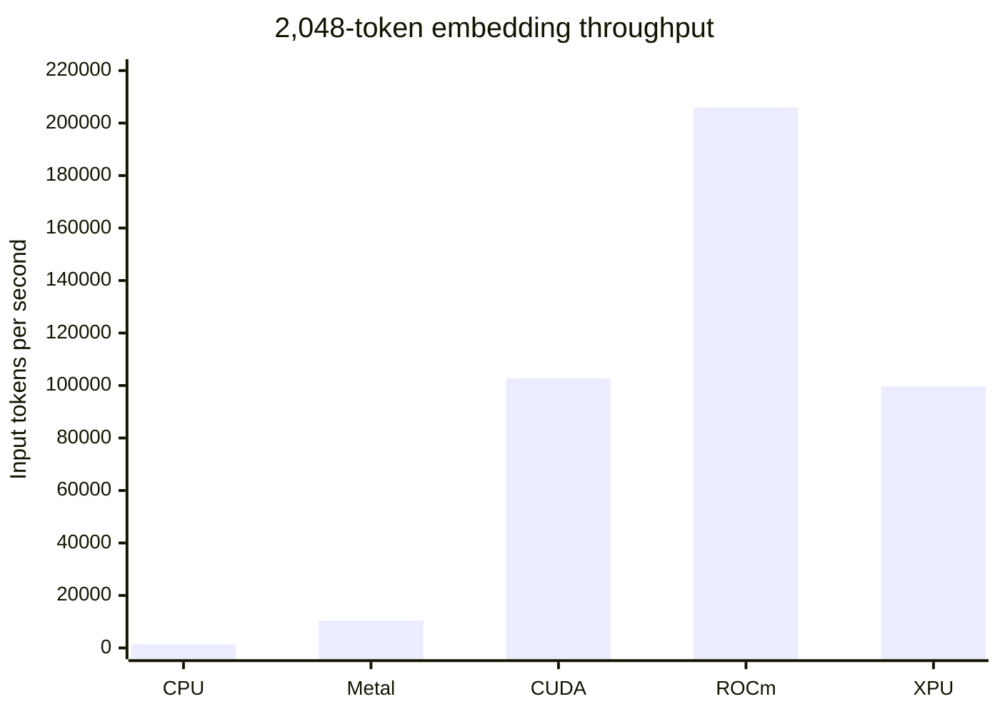

# embeddinggemma

**The fastest way to serve EmbeddingGemma. Anywhere.**

`embeddinggemma` is a tiny, model-specialized embeddings server for
EmbeddingGemma 300M. It runs on CPU, Apple Metal, NVIDIA CUDA, AMD ROCm, and
Intel XPU SYCL from a single native executable per platform.

It is fast as fuck, and the CPU binary is about 100 KiB.

- Hand-tuned inference kernels for every supported accelerator family.
- Dynamic batching, bounded queues, duplicate singleflight, and exact-result
  caching for concurrent serving.
- Matryoshka embeddings at 768, 512, 256, and 128 dimensions.
- Automatic model download and a built-in HTTP server on port `42666`.

## Basic Usage

Start the server. The correct backend is built into each platform binary and
selected automatically:

```sh
embeddinggemma
```

The model is downloaded on first run to
`${XDG_CACHE_HOME:-$HOME/.cache}/embeddinggemma.c/`.

Create an embedding:

```sh
curl -sS http://127.0.0.1:42666/api/embed \
  -H 'Content-Type: application/json' \
  -d '{
    "model": "embeddinggemma-300m",
    "input": ["search_query: what powers the cell"],
    "dimensions": 256
  }'
```

The response is:

```json
{"embeddings":[[0.0123,-0.0456]]}
```

`input` accepts one string or an array of strings. `dimensions` is optional and
may be `768`, `512`, `256`, or `128`; the default is `768`. Reduced Matryoshka
embeddings are normalized again before being returned. Set
`"encoding_format":"base64"` to receive packed little-endian float32 data
instead of JSON float arrays.

Open [http://127.0.0.1:42666/docs](http://127.0.0.1:42666/docs) for the embedded
API reference. `GET /healthz` reports readiness, and `--bind`, `--port`, and
`--model` override the listening address, canonical port, and model path.

## Install

Install the latest release as `~/.local/bin/embeddinggemma`:

```sh
curl -fsSL https://raw.githubusercontent.com/QuixiAI/embeddinggemma.c/main/install.sh | sh
```

The installer detects the host and selects Metal on Apple Silicon or CUDA,
ROCm, XPU, or CPU on Linux x86_64. It verifies the release checksum before
replacing an existing installation and falls back to CPU when an accelerator
runtime is unavailable.

Pin a release, backend, or installation directory when needed:

```sh
./install.sh --version v0.2.5
./install.sh --variant cpu
./install.sh --install-dir "$HOME/bin"
```

Published executables are deliberately small. Release `v0.2.5` contains:

| platform | backend | executable size |
|---|---|---:|
| macOS ARM64 | CPU | 123 KiB |
| macOS ARM64 | Metal | 400 KiB |
| Linux x86_64 | CPU | 98 KiB |
| Linux x86_64 | CUDA | 8.7 MiB |
| Linux x86_64 | ROCm | 1.2 MiB |
| Linux x86_64 | XPU SYCL | 2.0 MiB |

The 278 MB Q4_0 model is downloaded separately from Hugging Face and is not
distributed by this project.

## Performance

These are warmed median measurements of the complete 300M Q4_0 inference
engine, including token embedding through final pooling and normalization.
They are absolute results from the listed machines, not normalized same-device
backend comparisons.

| backend | tested hardware | 1-token req/s | 32-token tok/s | 2,048-token tok/s |
|---|---|---:|---:|---:|
| CPU | Apple M5 Max | 370 | 1,051 | 1,350 |
| Metal | Apple M5 Max | 570 | 8,009 | 10,465 |
| CUDA | NVIDIA RTX 3090 | 584 | 13,897 | 102,755 |
| ROCm | AMD Instinct MI300X | 1,072 | 8,890 | 206,011 |
| XPU SYCL | Intel Arc Pro B60 | 962 | 14,747 | 99,708 |

At 32-token concurrency, the production scheduler reaches 3,279 req/s on an
RTX 3090, 3,952 req/s on an MI300X, and 3,411 req/s in an explicit batch on an
Arc Pro B60. The MI300X reaches 26,014 req/s for a packed batch of 72 one-token
requests. Long-context throughput peaks at 206,011 input tokens/s.



A same-host comparison against Ollama, vLLM, and Hugging Face
text-embeddings-inference is the next benchmark publication. Those numbers will
use identical prompts, model semantics, warmups, concurrency, and hardware;
cross-project numbers from different machines will not be presented as a fair
ranking. Reproduction commands and all retained/rejected kernel experiments are
documented in [`perf/`](perf/).

## GitHub Stars

[](https://www.star-history.com/#QuixiAI/embeddinggemma.c&Date)

Development setup, backend internals, test requirements, and performance rules
are in [CONTRIBUTING.md](CONTRIBUTING.md). Release builds and artifact
publication are documented in [RELEASE.md](RELEASE.md).
